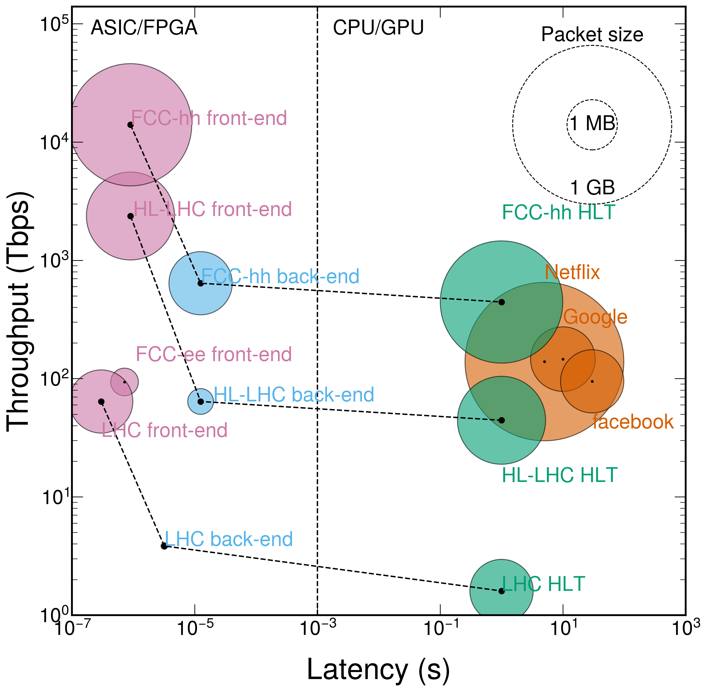

# Latency, throughput and packet size for CERN data aquisition tiers vs industry

Using numbers from [this Google sheet](https://docs.google.com/spreadsheets/d/1sG9q4gRvuYhntJKcbKlxJx_koTWvsMKISdNAG4uLCHA/edit?usp=sharing), plot latency/throughput/packet size for typical CERN data aquisition tiers. Feel free to add other data processing tiers to list!

Recommend to run notebook in Google Colab!

